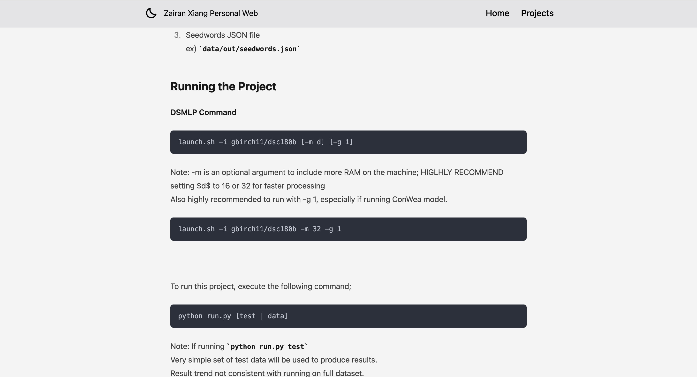

# ids721-indiv1

[My Zola Web](https://individual-project1-zx122-5dccb406e897eb1cd4510fa85e616a28b228c.gitlab.io/)

# Continuous Delivery of Personal Website

This project focuses on the creation and continuous delivery of a personal website. The website is built using Zola, a fast and efficient static site generator written in Rust, and uses GitLab workflow to build and deploy site on push.

## Project Setup
1. install zola
2. initialize the project by `zola init project_name`
3. build the project and run the server by doing ` zola build` and `zola serve`
4. Download your chosen theme to the `themes` directory.
5. Update the `theme` variable in the configuration file to match the name of your theme's directory (e.g., `themes/kita`).
6. Follow the configuration instructions provided in your theme's documentation.
7. Update the `config.toml` file in the project's root directory with the theme's `config.toml` settings. Customize this file to include personal informations.

## Website Live
This Personal website has a home page and a project page; the project page contains links that navigate to more detailed information about each project: 

### Home Page

### Projects Page

### Project Detail Page
- Detailed view of a selected project.
- Direct links to the corresponding GitHub page or website.
- Some information on how to run the project

## Deployment

1. **Create a `.gitlab-ci.yml` File:**: This file is used by GitLab CI/CD to manage your project's jobs.

2. **Configure the CI/CD Pipeline:**

3. **Commit and Push to GitLab:**

4. **Check Pipeline Status:**
   After pushing, navigate to `CI/CD > Pipelines` in your GitLab repository to check the status of your pipeline. Once it's passed, your site is live.

5. **Accessing Your Site:**
   Your site will be available under the `Pages` in the `Deploy` tab.

## Demo Video link
- [Youtube Link](https://youtu.be/_m8Q7Sda6BI)
